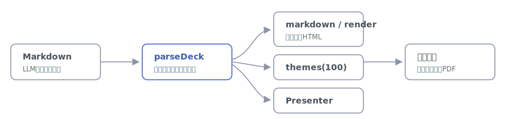

# maku

[](https://github.com/miruky/maku/actions/workflows/ci.yml)
[](https://www.typescriptlang.org/)
[](https://vitest.dev/)
[](https://opensource.org/licenses/MIT)

**Markdownを書くだけでスライドになる、264種類のテーマから選べるプレゼンテーションツールです。**

## 概要

Markdownを貼り付けると、その場でスライドに変換して表示します。`---` で区切れば次のスライドへ、HTMLコメントのディレクティブでレイアウト(14種類)・背景・段階表示・発表者ノートを指定でき、表やコード、段組、グリッド、年表、数値強調、引用、画像分割などにも対応します。デザインは色44系統 × 昼夜 × 明朝/ゴシック/丸ゴシックの264テーマから選べ、選んだテーマはURLに乗るので共有もできます。画像はドラッグ&ドロップ・貼り付け・ファイル選択で取り込め、Markdownへの挿入かスライドへの自由配置かを選べます。全文ブラウザ内で動き、サーバーには何も送りません。LLMで整えたMarkdownをそのまま流し込むことを想定しています。

遊ぶ: https://miruky.github.io/maku/

### なぜ作ったのか

発表資料づくりは、内容を考える時間より、体裁を整える時間に食われがちです。原稿がMarkdownで手元にあるなら、区切りと少しの指示だけでスライドになり、テーマを選ぶだけで体裁が決まるべきです。凝ったテンプレートを編集するのではなく、文章に集中したまま見栄えのする資料にしたくて作りました。テーマを100用意したのは、内容の性格に合う「ちょうどいい一つ」を選ぶ楽しさのためです。

## 書き方

| 記法 | 効果 |
|:--|:--|
| `---`(単独行) | スライドの区切り |
| 先頭の `---` ブロック | フロントマター(`title:`、`theme:`、`accent:`、`transition:`、`headingDivider:`、`size:`、`autoslide:` など) |
| `<!-- center -->` / `title` / `full` | レイアウト(中央寄せ・表紙・全面) |
| `<!-- layout: split / grid / cards / stats / timeline / quote / section / compare / image-left / image-right -->` | レイアウト(段組・グリッド・カード・数値強調・年表・引用・章扉・対比・画像分割) |
| `===`(単独行) | 段組・グリッド・各段の区切り |
| `<!-- bg: 色またはURL -->` | スライドの背景(色・画像) |
| `<!-- incremental -->` / `<!-- reveal: key-first -->` | 段階表示(順番に / 要点を先に) |
| `<!-- key -->` / `<!-- step: N -->` / `<!-- group -->` / `<!-- pin -->` | 段階表示のマーカー(直後のブロックに付与) |
| `<!-- class: 名前 -->` | 任意のクラスを付与 |
| `<!-- transition: fade/slide/zoom/none -->` | スライド切替の演出(フロントマター `transition:` でデッキ既定も指定可) |
| ` ```言語 title=ファイル名 lineNumbers ` | コードブロックの言語・タイトル帯・行番号(情報文字列) |
| `$…$` / `$$…$$` | 数式(KaTeX をインライン / ブロックで描画。ライブラリは使用時のみ遅延ロード) |
| ` ```mermaid ` | Mermaid 図(フローチャート・シーケンス図など。使用時のみ遅延ロードして SVG 描画) |
| `<!-- header: 文 -->` / `<!-- footer: 文 -->` / `<!-- paginate -->` | ヘッダ・フッタ・ページ番号(フロントマターでデッキ既定、スライドで上書き) |
| `<!-- toc -->` / `<!-- agenda -->` | そのスライドに全スライドの見出しから目次を自動生成 |
| `<!-- hide -->` / `<!-- skip -->` | そのスライドを発表・一覧・書き出しから除外(原稿には残す。下書き/予備に) |
| `<!-- autoslide: 5 -->` | このスライドの自動送り時間(秒。`off` で停止。フロントマター `autoslide:`・`loop: true` でデッキ全体) |
| `???` 以降 | 発表者ノート |

本文では見出し・段落・**強調**・打ち消し・`コード`・リンク・画像・引用・箇条書き(入れ子)・番号付き・タスクリスト・表・コードブロック・**数式**が使えます。さらに `==ハイライト==`・上付き `x^2^`・下付き `H~2~O`(Marp / Pandoc 互換)にも対応し、ハイライトは選んだテーマのアクセント色で明暗どちらでも読みやすく着色します。コードブロックは**言語別に色分け(シンタックスハイライト)**され、全テーマで配色がWCAG AAを満たします(依存ライブラリなしの自前トークナイザ)。コードブロックにマウスを重ねると**コピーボタン**が出ます。`$…$` / `$$…$$` の**数式**は KaTeX で描画します(初期表示を軽く保つため、数式を含むときだけ遅延ロード)。` ```mermaid ` の**図**(フローチャート・シーケンス図など)も同様に、使うときだけ遅延ロードして SVG にします。`:smile:` などの**絵文字ショートコード**、画像の alt に書く**表示指定**(``)にも対応します。

見出しレベルでの自動分割(`headingDivider: 2` で `##` ごとに新しいスライド)を使えば、`---` を入れずにフラットな原稿をそのままデッキにできます。スライドの縦横比はフロントマター `size: 16:9`(`4:3`・`16x9`・`1920x1080` なども可)で変えられ、表示・書き出しの両方に反映されます。`accent: "#e2007a"` のように指定すれば、選んだテーマのまま主役色だけを自社カラーに差し替えられます(表示・書き出しに反映)。`autoslide:`(+`loop:`)を指定すると、発表中にスライドを自動で送る**キオスク表示**になります(`A` キーで一時停止・再開)。

### レイアウト(14種類)

`default`(既定) / `center`(中央寄せ) / `title`(表紙) / `full`(全面) / `split`(左右段組) / `grid`(格子) / `cards`(カード) / `stats`(数値強調) / `timeline`(年表) / `quote`(大判引用) / `section`(章扉) / `compare`(対比) / `image-left`・`image-right`(画像分割)。`split`・`grid`・`cards`・`stats`・`compare`・`section` は `===` で各部を区切ります。`timeline` はトップレベルの箇条書き1項目が1イベント(`時 === ラベル` で時を分けられます)。`stats` は各部の先頭行が大きな数値、続く行がキャプション(`####` で上ラベル)。

## 使い方(操作)

- **→ / Space**: 次へ(段階表示も進む) / **←**: 戻る / **Home・End**: 最初・最後 / **数字 + Enter**: その番号のスライドへジャンプ
- **Ctrl / ⌘ + Z**: 取り消し / **Ctrl / ⌘ + Shift + Z**(または Ctrl+Y): やり直し。Markdown編集に加え、スライドの直接編集・図形/画像の自由配置・削除なども戻せます(テキスト入力欄ではブラウザ標準の取り消しがそのまま効きます)
- **F**: 全画面 / **O**: スライド一覧 / **S**: 発表者ノート(次スライドのプレビュー・ステップ進捗・タイマー) / **V**: 発表者ビュー(別ウィンドウ) / **E**: 編集パネル
- **スライド一覧での並べ替え**: 一覧(O)でサムネイルをドラッグすると順序を入れ替えられます。Markdown本文ごと並び替わり(隠しスライドも保持)、自由配置の図形・画像も追従、Ctrl/⌘+Z で取り消せます
- **発表者ビュー(V)**: 別ウィンドウで「現在のスライド・次のスライド・ノート・経過タイマー・進捗」を手元に表示。投影画面(本体ウィンドウ)とは BroadcastChannel でリアルタイム同期し、どちらからでも操作できます(サーバー不要・同一ブラウザ内)。2画面・拡張ディスプレイでの発表向け
- **B**: 画面を黒幕 / **W**: 白幕(発表中の注目誘導。もう一度かどれかのキーで解除)
- **D**: 手書きペン / **L**: レーザーポインタ(発表中の指し示し。**C** で手書きを消去、もう一度か Esc で終了)
- **T**: テーマ選択(264種類) / **P**: 書き出しメニュー / **A**: 自動送り(キオスク)の一時停止・再開 / **?**: ヘルプ(ガイド & FAQ)
- スマートフォンは左右スワイプで移動
- 手元の `.md` を「開く」から読み込み、ドラッグ&ドロップにも対応

## 段階表示(一つずつ見せる)

「開いたら①、→ で②、また → で③…」のように順番に見せられます。**設定は記法を覚えなくてOK** — 「スライドを直接編集」をオンにし、見せたいブロックを**右クリック →「順番を付ける」**で 1・2・3… と番号を振るだけ。番号を付けたブロックだけがその順で現れ、付けていないブロックは最初から表示されます(段階表示は自動でオン)。各ブロック左肩の番号バッジをクリックしても同じメニューが開きます。

- **複数まとめて同時に**: ブロックを **Shift+クリック**で複数選び、右クリック →「**まとめて同時に出す**」(グループ化)
- **直前と同時に出す / 要点として先に出す / ずっと表示する / 順番から外す** … 右クリックから個別指定
- 何もない所を右クリック →「**段階表示**」で、**順番に / 要点を先に / 番号で指定 / なし** をスライド単位で切替
- 編集中は全ブロックが見えています(番号で順序確認)。実際に隠れて段階表示になるのは**発表・閲覧のとき**
- 上級者は記法でも指定可: `<!-- reveal: sequential | key-first | manual -->` と、ブロック直前の `<!-- step: N -->` / `<!-- group -->` / `<!-- key -->` / `<!-- pin -->`(右クリック操作はこの記法を自動で書き込みます)
- 書き出し(PDF / PPTX / 画像)では畳まれ、**最終状態(全部表示)**になります

## 直接編集・自由配置

ツールバーの「スライドを直接編集」をオンにすると、スライド上で直接編集できます。**本文(Markdown)はレイアウトが配置し、自由に置きたいものはオーバーレイ要素として足す**、という二層構成です。

**本文の文字編集(双方向)**

- 見出し・段落・箇条書き・引用・表のセル・コードなどの本文ブロックは、クリックで選択 → もう一度クリック/ダブルクリックでその場編集
- 書き換えると対応するMarkdownが即更新され、逆にMarkdownを編集すればスライドに反映されます(各ブロックは元のソース範囲を保持)
- 本文の**位置はレイアウトが決めます**(自由移動はしません)。これにより構成変更や段組でも選択・編集が安定します

**自由配置(テキストボックス・図形・画像)**

- 挿入ツールバーから、任意の位置に**テキストボックス**・**図形**(四角形・円・三角形・直線・矢印)・**画像**を追加
- ドラッグで移動、角ハンドルでリサイズ、矢印キーで微調整(Shiftで大きく)、Deleteで削除
- 移動中はスライドの中心・端や他の要素の辺に**自動で吸着(整列ガイド表示)**。Cmd/Ctrl(またはAlt)で一時無効化
- 画像はツールバーの画像ボタン・**ドラッグ&ドロップ**・**貼り付け**(Cmd/Ctrl+V)で取り込め、**Markdownに挿入**するか**スライドに自由配置**するかを選べます(自由配置画像は縦横比を保ってリサイズ。Shiftで自由変形)
- これらの自由配置要素は**Markdownには書き込まれません**(レイアウト情報として別に保存)。書き出し(PDF / PPTX / 画像)にもそのまま反映されます
- 発表(全画面)中は直接編集が自動でオフになります
- 本文が枠からはみ出すスライドは、発表・閲覧・書き出し時に**自動で縮小**して収めます(切れません)

## 書き出し

書き出しメニューから、選んだテーマの見た目そのままで出力できます。各スライドを実寸でラスタライズして敷き詰めるため、画面の体裁を完全に保ちます(変換ライブラリは書き出し時に遅延読み込みします)。

- **PDF**: 各スライドを1ページに、横向きのPDFとしてダウンロード
- **PowerPoint (.pptx)**: 各スライドを画像として配置した .pptx をダウンロード。発表者ノートも引き継ぎます
- **Google スライド**: 同じ .pptx を書き出し、Google ドライブ/スライドへの取り込み手順を案内します(Google スライドは .pptx のインポートに対応)
- **画像 (.png)**: 表示中のスライド1枚を実寸のPNG画像として保存
- **単体HTML**: スライド・テーマ・数式・自由配置を1つの `.html` に同梱。サーバー不要でダブルクリックすれば、矢印キー/クリックでめくれる配布用ファイルになります
- **Markdown / 印刷**: 編集中の Markdown 保存、ブラウザ印刷。印刷ダイアログで「PDFとして保存」を選ぶと、**文字を選択・検索できる**ベクタPDFになります(数式・Mermaid図も描画してから印刷)

## アーキテクチャ



Markdown文書を `parseDeck` がフロントマター・スライド・ディレクティブ・段階表示・ノートに分解し、`markdown`/`render` が14レイアウトのスライドHTMLを、`themes` が264種類の配色・書体を、`Presenter` が表示と移動・段階表示・ノートを、`overlay` が自由配置・図形・画像を受け持ちます。解釈・描画・テーマ生成はDOMから独立した純粋な処理で、ブラウザなしでテストしています。

## 技術スタック

| カテゴリ | 技術 |
|:--|:--|
| 言語 | TypeScript 5(strict) |
| ビルド | Vite 8 |
| テスト | Vitest(202テスト) |
| リンタ | ESLint + Prettier |
| CI / CD | GitHub Actions |
| 配信 | GitHub Pages |
| 実行時依存 | なし |

## プロジェクト構成

- `src/markdown.ts` — スライド本文用のMarkdownレンダラ(段階表示の data-step も付与)
- `src/highlight.ts` — 依存ゼロ・DOM非依存のシンタックスハイライタ(コードブロックを色分け)
- `src/emoji.ts` — `:shortcode:` 絵文字の置換テーブル
- `src/math.ts` — 数式の遅延描画(KaTeX を使用時のみ動的import)
- `src/mermaid.ts` — Mermaid 図の遅延描画(mermaid を使用時のみ動的import)
- `src/fit.ts` — はみ出す本文をスライド枠に収める自動縮小(表示・書き出し共通)
- `src/annot.ts` — 発表中の手書きペン/レーザーポインタ(deck-root を覆うキャンバス)
- `src/deck.ts` — 文書をスライド集合へ分解(フロントマター・区切り・指示・段階表示・ノート・段組)
- `src/themes.ts` — 264テーマの生成(色44系統 × 昼夜 × 明朝/ゴシック/丸ゴシック)
- `src/render.ts` — 14レイアウトのスライドHTML生成(直接編集用に元ソース範囲も埋め込む)
- `src/present.ts` — 表示・移動・段階表示(キーメッセージ先行)・ノート・進捗
- `src/edit.ts` — 編集されたスライドのDOMをMarkdownへ戻す(直接編集の view → md)
- `src/overlay.ts` — 自由配置・図形・画像のレイヤ(位置/サイズ/図形/画像をMarkdown外に保持)
- `src/export.ts` — PDF / PPTX / PNG / 単体HTML 書き出し(重いライブラリは遅延読み込み)
- `src/presenter-window.ts` / `presenter.html` — 発表者ビュー(別ウィンドウ)。純粋コアを再利用して現/次スライド・ノート・タイマーを表示
- `src/sync.ts` — 本体と発表者ビューの同期(同一オリジンの BroadcastChannel。サーバー不要)
- `src/main.ts` — エディタ・テーマ選択・一覧・全画面・書き出し・直接編集などのUI
- `docs/architecture.svg` — アーキテクチャ図

## はじめ方

### 前提条件

- Node.js 20 以上

### セットアップ

```bash
git clone https://github.com/miruky/maku.git
cd maku
npm install
npm run dev
```

### テストの実行

```bash
npm test
```

### Lintの実行

```bash
npm run lint
```

### デプロイ

`main` ブランチへのプッシュで GitHub Actions がビルドし、GitHub Pages へ配信します。

## 設計方針

- **文章に集中させる** — 区切りと最小限の指示だけでスライドになり、体裁はテーマが引き受ける
- **264テーマを体系生成** — 色・明度・書体を規則的に組み、どれも統一感のある仕上がりにする。本文・リンク・小見出しの配色はWCAG AA(コントラスト比4.5以上)を全テーマで満たすよう明度を自動調整し、テストで担保する
- **解釈と表示の分離** — パース・描画・テーマをDOM非依存にし、テストで担保する
- **データを外に出さない** — 変換も表示もブラウザ内で完結する

## 制約

数式は KaTeX に対応しています(使用時のみ遅延ロード)が、ブラウザ依存でばらつくフォント自体の埋め込みには対応していません。PDFは各スライドをラスタライズして敷き詰めるため、余白や改ページの細部は環境差が出ることがあります。画像の CSS フィルタ指定(`blur:` など)は画面表示・単体HTML書き出しでは反映されますが、ラスタライズ書き出し(PDF / PPTX / PNG)には反映されません(`rounded`・`shadow` は全書き出しで反映されます)。

## ライセンス

[MIT](LICENSE)
